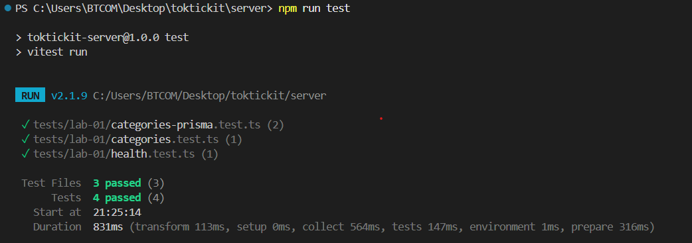
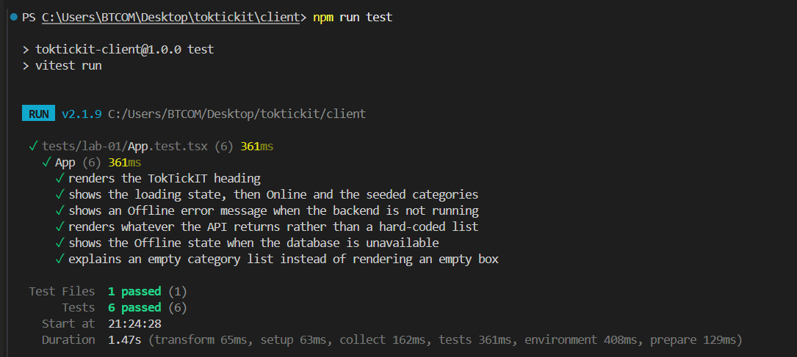

# Lab 1 — Test Plan and Evidence

Run everything: `cd server && npm test` · `cd client && npm test`

All test files live under `server/tests/lab-01/` and `client/tests/lab-01/`.

## Test inventory

| ID | Test File | Tool | Test Description | Status |
| --- | --- | --- | --- | --- |
| API-01 | `server/tests/lab-01/health.test.ts` | Supertest | `GET /api/health` returns 200 with `status = ok` and the service name | ✅ Implemented (Issue #2) |
| API-02 | `server/tests/lab-01/categories.test.ts` | Supertest | `GET /api/categories` returns the four seeded categories in id order | ✅ Implemented (Issue #4) |
| API-03 | `server/tests/lab-01/categories-prisma.test.ts` | Supertest | The route queries Prisma with `select` id/name and `orderBy` id ascending | ✅ Implemented (Issue #4) |
| API-04 | `server/tests/lab-01/categories-prisma.test.ts` | Supertest | An unreachable database degrades to 503 without leaking internal detail | ✅ Implemented (Issue #4) |
| UI-01 | `client/tests/lab-01/App.test.tsx` | Vitest | The TokTickIT heading renders | ✅ Implemented (Issue #2) |
| UI-02 | `client/tests/lab-01/App.test.tsx` | Vitest | Loading state changes to Online plus the seeded category list | ✅ Implemented (Issue #4) |
| UI-03 | `client/tests/lab-01/App.test.tsx` | Vitest | A backend that is not running shows Offline and a useful error message | ✅ Implemented (Issue #4) |
| UI-04 | `client/tests/lab-01/App.test.tsx` | Vitest | The list renders whatever the API returns, not hard-coded values | ✅ Implemented (Issue #4) |
| UI-05 | `client/tests/lab-01/App.test.tsx` | Vitest | A 503 from the category endpoint shows Offline with the reason | ✅ Implemented (Issue #4) |
| UI-06 | `client/tests/lab-01/App.test.tsx` | Vitest | An empty category list is explained instead of drawn as an empty box | ✅ Implemented (Issue #4) |

The lab sheet's section 11 asks for four tests as a minimum: API-01, API-02, UI-01, and one working
state test. API-03 to API-04 and UI-04 to UI-06 go past that minimum deliberately — they cover the
query contract and the database-outage path, which the four required tests leave untouched.

> **Status** describes the state of the test code. The proof that each one passes is in **Evidence** below.

---

## Evidence

### **Server — Supertest (API-01 … API-04)**



```text
PS C:\Users\BTCOM\Desktop\toktickit\server> npx vitest run --reporter=verbose

 RUN  v2.1.9 C:/Users/BTCOM/Desktop/toktickit/server

 ✓ tests/lab-01/categories-prisma.test.ts > GET /api/categories — query contract > asks Prisma for id and name only, ordered by id ascending
 ✓ tests/lab-01/categories-prisma.test.ts > GET /api/categories — database unavailable > answers 503 with a message that leaks no internal detail
 ✓ tests/lab-01/health.test.ts > GET /api/health > returns 200 with status ok and the service name
 ✓ tests/lab-01/categories.test.ts > GET /api/categories > returns the four seeded categories in id order

 Test Files  3 passed (3)
      Tests  4 passed (4)
   Start at  21:08:54
   Duration  809ms (transform 175ms, setup 0ms, collect 750ms, tests 142ms, environment 1ms, prepare 440ms)
```

### **Client — Vitest (UI-01 … UI-06)**



```text
PS C:\Users\BTCOM\Desktop\toktickit\client> npx vitest run --reporter=verbose

 RUN  v2.1.9 C:/Users/BTCOM/Desktop/toktickit/client

 ✓ tests/lab-01/App.test.tsx > App > renders the TokTickIT heading
 ✓ tests/lab-01/App.test.tsx > App > shows the loading state, then Online and the seeded categories
 ✓ tests/lab-01/App.test.tsx > App > shows an Offline error message when the backend is not running
 ✓ tests/lab-01/App.test.tsx > App > renders whatever the API returns rather than a hard-coded list
 ✓ tests/lab-01/App.test.tsx > App > shows the Offline state when the database is unavailable
 ✓ tests/lab-01/App.test.tsx > App > explains an empty category list instead of rendering an empty box

 Test Files  1 passed (1)
      Tests  6 passed (6)
   Start at  21:08:57
   Duration  1.51s (transform 64ms, setup 68ms, collect 171ms, tests 325ms, environment 423ms, prepare 111ms)
```

### API-01 — `GET /api/health`

**Manual check with `curl`**

```text
PS C:\Users\BTCOM\Desktop\toktickit> curl -i http://localhost:3000/api/health
HTTP/1.1 200 OK
X-Powered-By: Express
Access-Control-Allow-Origin: *
Content-Type: application/json; charset=utf-8
Content-Length: 41
ETag: W/"29-Ncbz1ycfASMBs5j/gSdtsYEDEbo"
Date: Wed, 12 Aug 2026 12:05:45 GMT
Connection: keep-alive
Keep-Alive: timeout=5

{"status":"ok","service":"TokTickIT API"}
```

### API-02 — `GET /api/categories`

**Manual check with `curl`** — the four seeded rows, in id order, with no extra fields

```text
PS C:\Users\BTCOM\Desktop\toktickit> curl -i http://localhost:3000/api/categories
HTTP/1.1 200 OK
X-Powered-By: Express
Access-Control-Allow-Origin: *
Content-Type: application/json; charset=utf-8
Content-Length: 118
ETag: W/"76-jaGSUw2JQ1w726FXYSCypSMsxJA"
Date: Sun, 16 Aug 2026 13:51:00 GMT
Connection: keep-alive
Keep-Alive: timeout=5

[{"id":1,"name":"Account and Access"},{"id":2,"name":"Hardware"},{"id":3,"name":"Software"},{"id":4,"name":"Network"}]
```

**Manual check with the database unreachable** — a second API instance was started against a
`DATABASE_URL` pointing at a port with no PostgreSQL behind it. `/api/health` still answers 200
because it is a liveness probe, while `/api/categories` degrades to 503 with a message that leaks
no connection details.

```text
PS C:\Users\BTCOM\Desktop\toktickit> curl -i http://localhost:3001/api/health
HTTP/1.1 200 OK
Content-Type: application/json; charset=utf-8

{"status":"ok","service":"TokTickIT API"}

PS C:\Users\BTCOM\Desktop\toktickit> curl -i http://localhost:3001/api/categories
HTTP/1.1 503 Service Unavailable
X-Powered-By: Express
Access-Control-Allow-Origin: *
Content-Type: application/json; charset=utf-8
Content-Length: 32
Date: Sun, 16 Aug 2026 13:51:32 GMT
Connection: keep-alive
Keep-Alive: timeout=5

{"error":"Database unavailable"}
```

### API-03 — Query contract

Prisma is stubbed for this file only, so the test can assert the query the route actually issues:
`{ orderBy: { id: "asc" }, select: { id: true, name: true } }`. This is the test that pins the
ordering down. API-02 alone cannot: on a freshly seeded table PostgreSQL returns the rows in id
order anyway, so API-02 stays green even with `orderBy` deleted — verified by removing it and
watching only API-03 go red.

### API-04 — Database unavailable

The stubbed Prisma client rejects with a connection error. The test asserts `503`, the exact body
`{ "error": "Database unavailable" }`, and that the host, port and driver name from the underlying
error appear nowhere in the response.

### UI-01 — Heading renders

Renders `App` with no interaction and asserts the TokTickIT heading is in the document. Green in the
client suite run above.

### UI-02 — Loading state changes to the category list

The stubbed `fetch` holds the health request open, so the test can assert the `role="status"`
loading line and the disabled button *before* releasing it. After the response arrives it asserts
the Online badge, that the loading line is gone, and that the four list items appear in the order
the API sent them. It also asserts which URLs were requested and how many times — without that,
a misspelled endpoint path would still pass.

### UI-03 — Backend not running

The stubbed `fetch` rejects with a `TypeError`, the same failure a browser produces against a
backend that is not running. The test asserts the `role="alert"` block shows `System Status: Offline`
with `Unable to connect to TokTickIT API`, and that no list items are rendered.

### UI-04 — The list is not hard-coded

The stub returns two categories that appear nowhere in the source (`Printer and Peripherals`,
`Payroll System`). The test asserts both render and that `Hardware` does **not** — so a component
painting a built-in list would fail here while UI-02 kept passing.

### UI-05 — Database unavailable

The stub answers the health call with 200 and the category call with 503, which is the failure the
lab sheet illustrates in Part 4: the API process is alive but PostgreSQL is not. The test asserts
the Offline alert and the `Category list failed with HTTP 503` detail line that distinguishes this
from a dead backend.

### UI-06 — Empty category list

The stub returns `[]`. The test asserts the app still reports Online — an unseeded database is not
an outage — and that the empty list is explained in words rather than drawn as an empty box.
